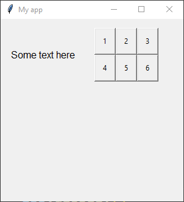

# guizero_autogrid

## Install

### pip

    pip install git+https://github.com/innovatedev-python/guizero-autogrid.git@v0.1.1

### poetry

    poetry add git+https://github.com/innovatedev-python/guizero-autogrid.git@v0.1.1

## Usage

Use the same as a [guizero `layout="grid"`](https://lawsie.github.io/guizero/box/), but you may leave off the `grid=[##, ##]` when using the `guizero_autogrid` widgets' arguments and it will layout the grid automatically. Can set a `spacing=[spacing_x, spacing_y]` value on the parent grid component to automatically apply padding to all grid items. Also has the ability to use `grid=NextRow` to place the widget in the first column in the next row. Limited support for span values... it may work, many combinations do not work yet.

Example (compare with [box examples from guizero](https://lawsie.github.io/guizero/box/#examples)):

    from guizero_autogrid import App, Text, Box, PushButton, NextRow
    def do_nothing():
        return 0

    app = App(title="My app", height=300, width=300, layout="grid", spacing=15)
    text = Text(app, text="Some text here")
    box = Box(app, layout="grid")
    button1 = PushButton(box, command=do_nothing, text="1")
    button2 = PushButton(box, command=do_nothing, text="2")
    button3 = PushButton(box, command=do_nothing, text="3")
    button4 = PushButton(box, command=do_nothing, text="4", grid=NextRow)
    button5 = PushButton(box, command=do_nothing, text="5")
    button6 = PushButton(box, command=do_nothing, text="6")
    app.display()

## Contributing

    poetry shell
    poetry install
    
    # code quality checks
    poe qa

    # format to code style
    poe format
